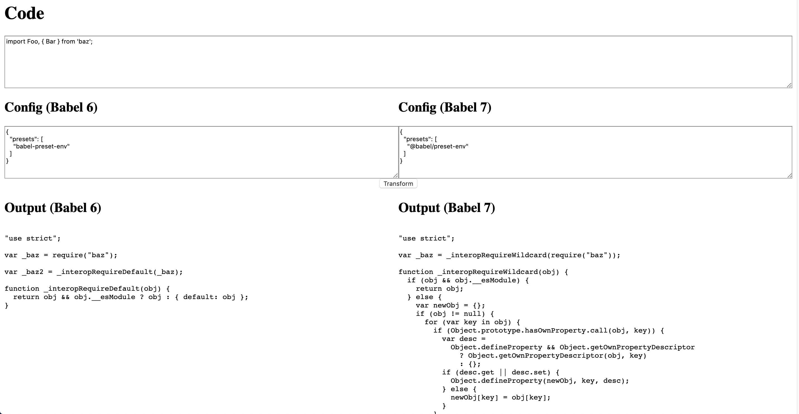

# `babel-compare`

Compare compilation output from babel 6 and babel 7.



## Usage

```
yarn install
yarn start
```

Then open <http://localhost:1234> in your browser.

## Notes

- Backend listens on port `8080`
- Frontend listens on port `1234`

## Customization

### Adding babel plugins/presets

To add a babel plugin or preset to use in your config(s):

- Ctrl+C the `yarn start` process
- `yarn add` the package you want
- Re-run the `yarn start` process
- Edit the config(s) in your browser to pull in the new plugins/presets.

### Changing babel versions

To change which versions of babel 6 or 7 are used, edit `package.json`, re-run `yarn install`, and then run `yarn start`.
